# ta_ex_7 — Automatización de Pruebas

**Examen Final — Automatización de Pruebas**
**Autor:** Francisco Alfaro

---

## 📋 Descripción del proyecto

`ta_ex_7` es un proyecto Maven que implementa una **calculadora de servicios** (aplicación Java con servidor web embebido) sobre la cual se aplican tres niveles de pruebas automatizadas. El proyecto incluye un pipeline de Integración Continua (CI) en Jenkins y un pipeline de despliegue (CD) con estrategia Blue-Green y rollback.

### Estructura del proyecto

```
ta_ex_7/
├── pom.xml                     # Configuración Maven y dependencias
├── Jenkinsfile                 # Pipeline de CI/CD
├── README.md                   # Este archivo
├── scripts/
│   ├── deploy.sh               # Despliegue Blue-Green en staging
│   ├── rollback.sh             # Reversión del despliegue
│   └── smoke-test.sh           # Verificación post-despliegue
└── src/
    ├── main/java/com/examen/app/
    │   ├── CalculadoraServicios.java   # Lógica de negocio
    │   └── ServidorWeb.java            # Servidor HTTP embebido
    └── test/java/com/examen/
        ├── unit/                       # Pruebas unitarias (JUnit 5)
        ├── integration/                # Pruebas de integración (HTTP)
        └── acceptance/                 # Pruebas de aceptación (Selenium)
```

---

## 🧪 Estrategia de pruebas

Se implementan **tres niveles** de pruebas automatizadas:

| Nivel | Framework | Clases | Qué verifica |
|---|---|---|---|
| **Unitarias** | JUnit 5 | `CalculadoraServiciosTest` | Operaciones aritméticas, cálculo de descuentos y manejo de excepciones |
| **Integración** | JUnit 5 + HttpClient | `ServidorWebIT` | Que el servidor real levanta y responde correctamente en sus endpoints |
| **Aceptación** | Selenium WebDriver | `CalculadoraAcceptanceTest` | El flujo real de usuario en el navegador: cargar la página, introducir datos y calcular |

**Total: 14 pruebas automatizadas.**

---

## 🔀 Flujo de ramas (GitFlow)

El repositorio sigue un flujo **GitFlow**:

- **`main`** — rama estable, contiene las versiones entregables.
- **`develop`** — rama de integración donde se fusionan las funcionalidades.
- **`feature/*`** — ramas temporales para cada funcionalidad o prueba.
- **`release/*`** — rama de preparación de versiones.

Los cambios se integran mediante Pull Requests hacia `develop` y, una vez validados por el pipeline, hacia `main`.

---

## ⚙️ Cómo ejecutar las pruebas

### Requisitos previos
- Java 17
- Maven 3.9+
- Navegador para las pruebas de aceptación (Chromium/Chrome en Linux, Edge en Windows)

### Comandos

```bash
# Compilar y empaquetar el jar ejecutable
mvn clean package -DskipTests

# Ejecutar solo las pruebas unitarias
mvn test

# Ejecutar todas las pruebas (unitarias + integración + aceptación)
mvn verify

# Ejecutar solo las pruebas de integración
mvn failsafe:integration-test failsafe:verify -Dit.test=ServidorWebIT

# Ejecutar solo las pruebas de aceptación
mvn failsafe:integration-test failsafe:verify -Dit.test=CalculadoraAcceptanceTest
```

### Ejecutar la aplicación manualmente

```bash
java -jar target/ta_ex_7-1.0.0.jar 8081
# Abrir http://localhost:8081 en el navegador
```

---

## 🔄 Pipelines

### Pipeline de CI (Jenkinsfile)

El pipeline declarativo incluye los siguientes stages:

1. **Checkout** — obtiene el código desde Git.
2. **Build** — compila y empaqueta el jar ejecutable (`mvn clean package -DskipTests`).
3. **Unit Tests** — ejecuta las pruebas unitarias (`mvn test`).
4. **Integration Tests** — ejecuta las pruebas de integración.
5. **Acceptance Tests** — ejecuta las pruebas de aceptación con Selenium.
6. **Deploy to Staging** — despliega en el ambiente de prueba.
7. **Smoke Test** — verifica que la aplicación responde.

### Pipeline de despliegue (CD)

El despliegue utiliza una estrategia **Blue-Green**:

- Se mantienen dos entornos idénticos (`blue` y `green`).
- La nueva versión se despliega en el entorno **inactivo**.
- Una vez validada con el smoke test, se conmuta el tráfico (`current`).
- Si algo falla, el `post { failure }` del Jenkinsfile ejecuta el **rollback** automático.

```bash
# Despliegue manual
./scripts/deploy.sh

# Verificación
./scripts/smoke-test.sh

# Rollback manual
./scripts/rollback.sh
```

---

## 📸 Evidencias

### Actividad 1 — Repositorio Git y configuración Maven

**Repositorio en GitHub:**

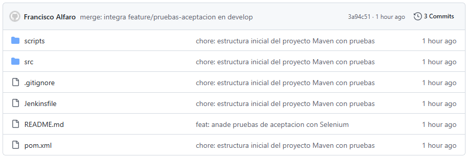

**Flujo de ramas (GitFlow):**

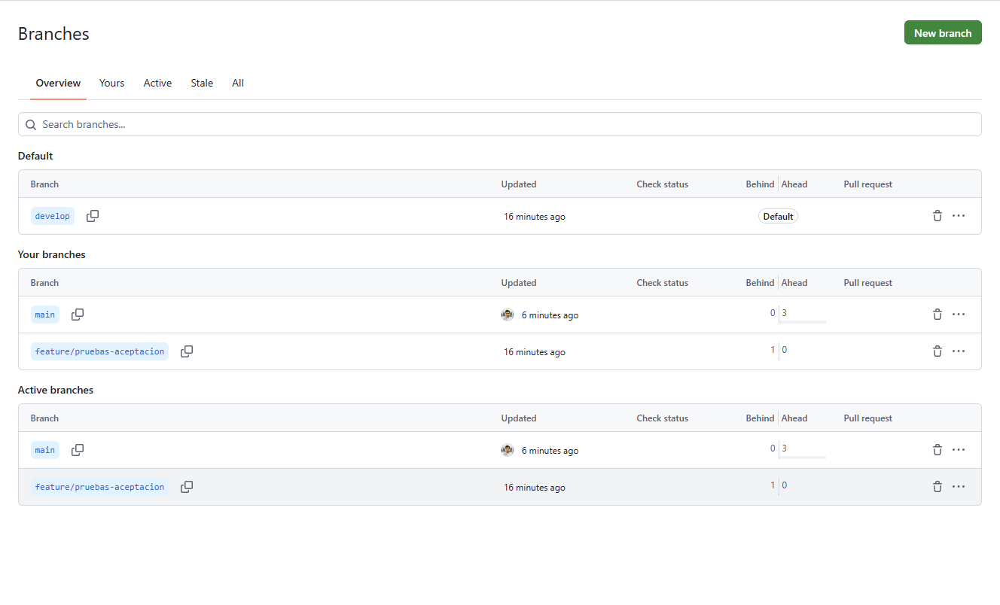

**Configuración Maven (`pom.xml`):**

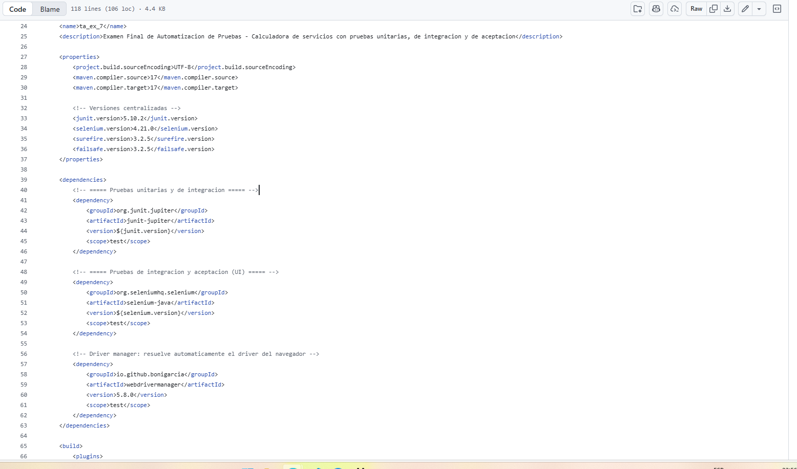

### Actividad 2 — Pipeline de CI

**Archivo `Jenkinsfile` versionado:**

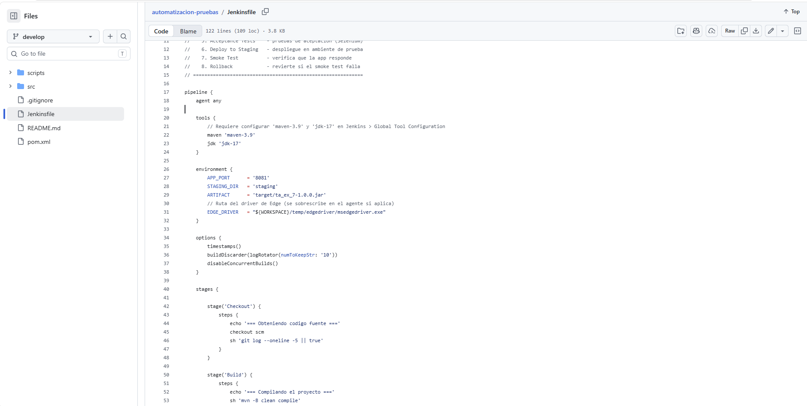

**Pipeline ejecutado con éxito:**

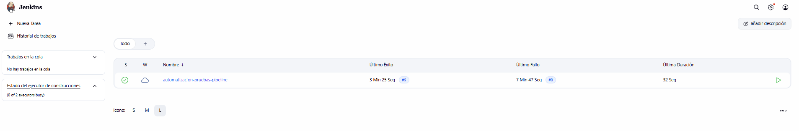

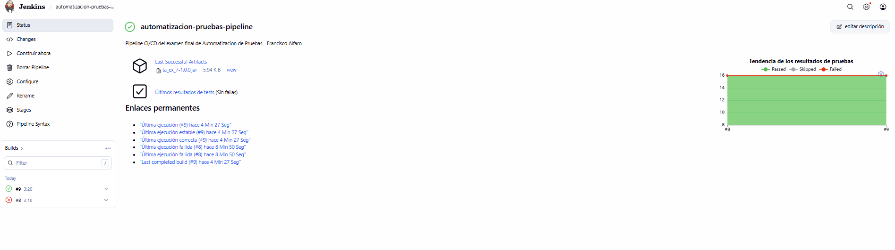

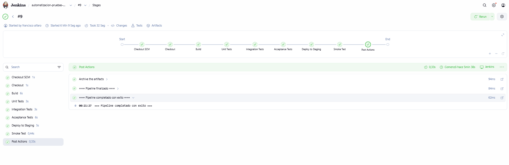

**Resultados de las pruebas automatizadas:**

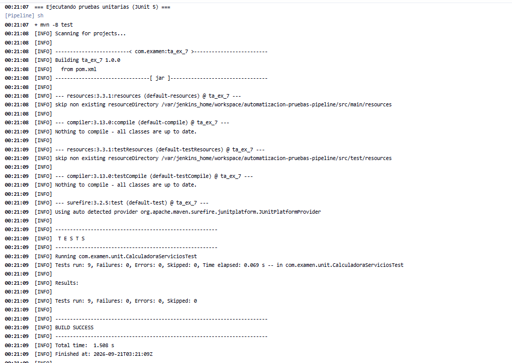

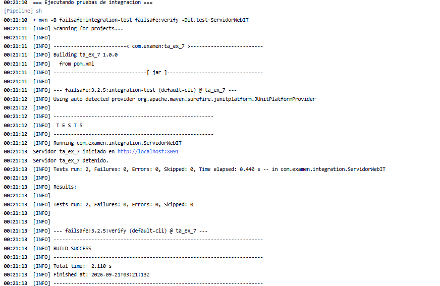

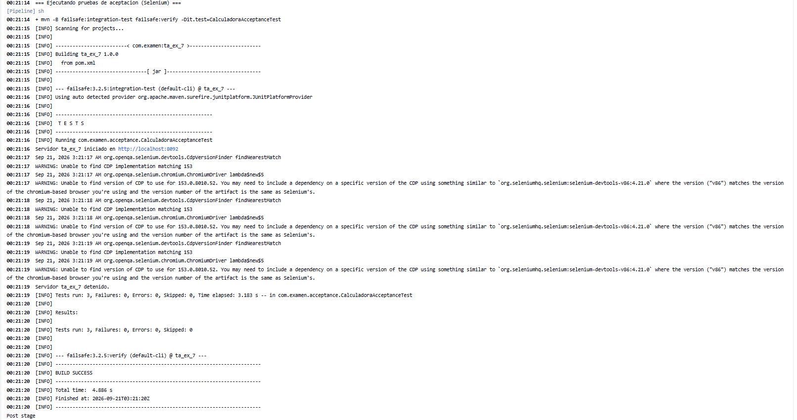

### Actividad 3 — Despliegue y rollback

**Script de despliegue Blue-Green (`deploy.sh`):**

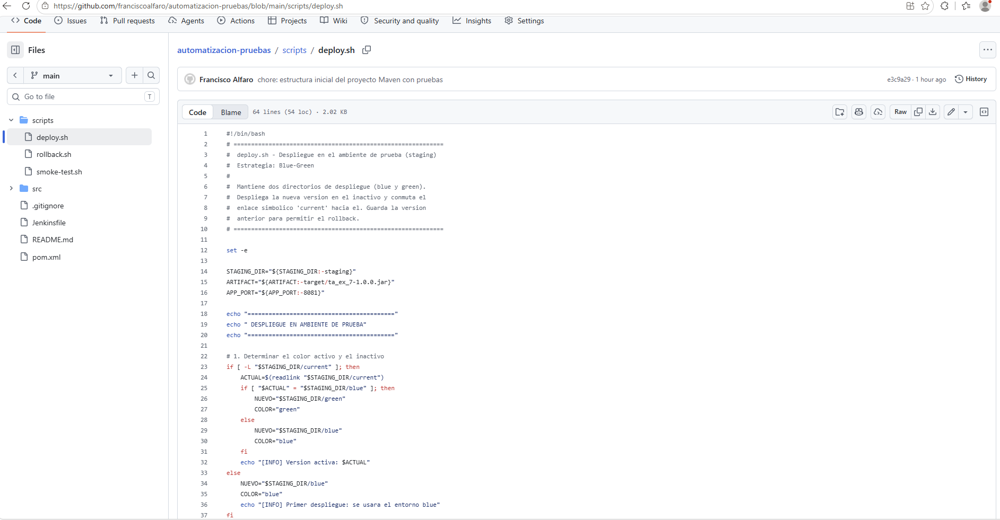

**Script de rollback (`rollback.sh`):**

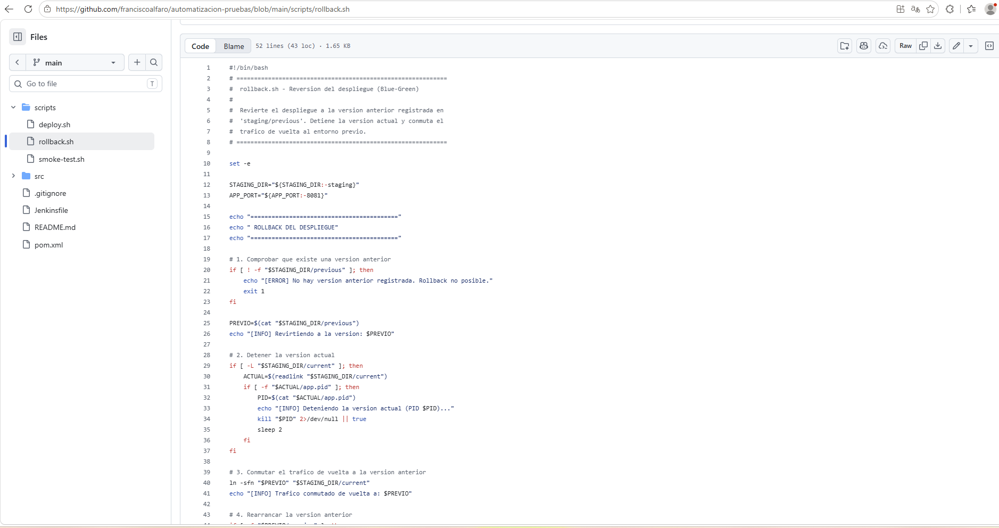

**Evidencia del despliegue en el ambiente de prueba:**

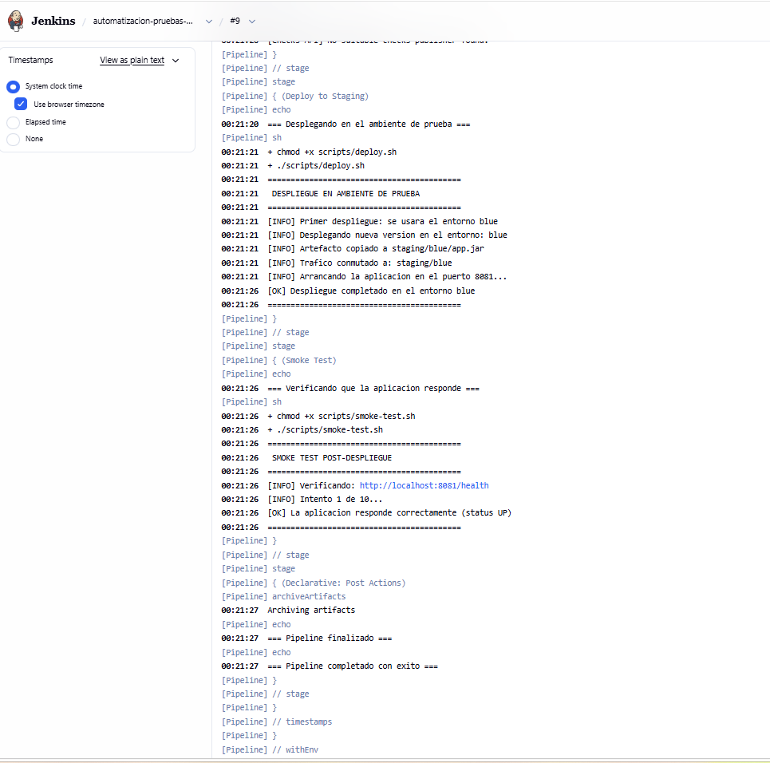

**Evidencia del rollback automático:**

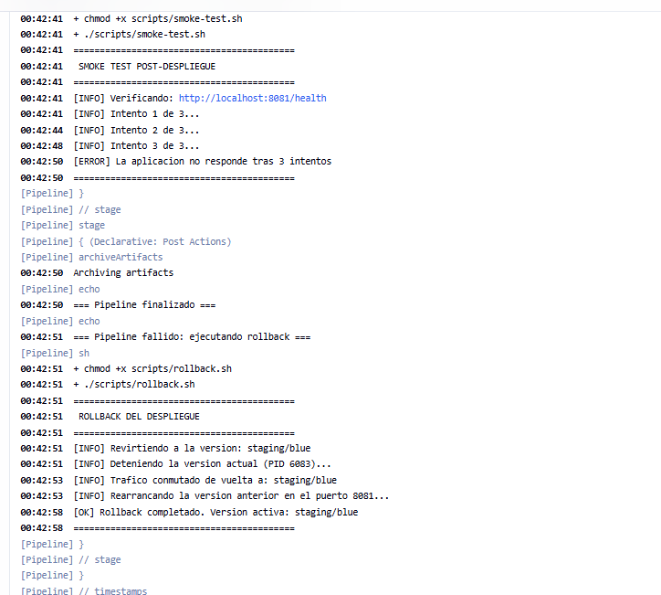

---

## 📄 Licencia

Proyecto académico — Examen Final de Automatización de Pruebas.
